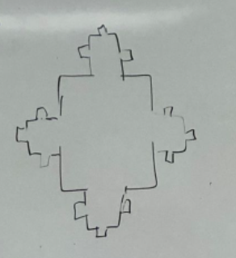
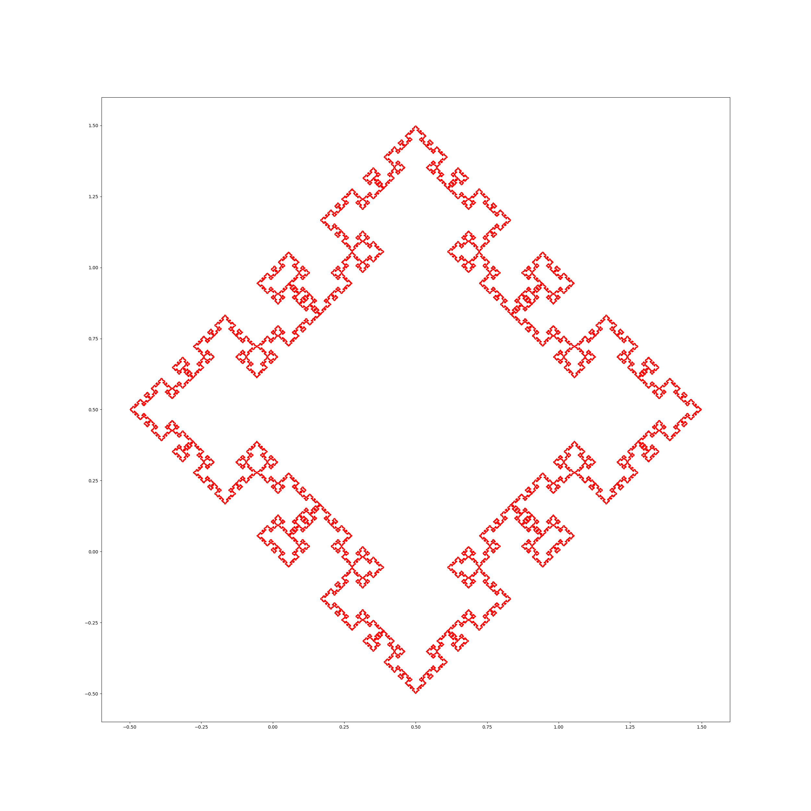
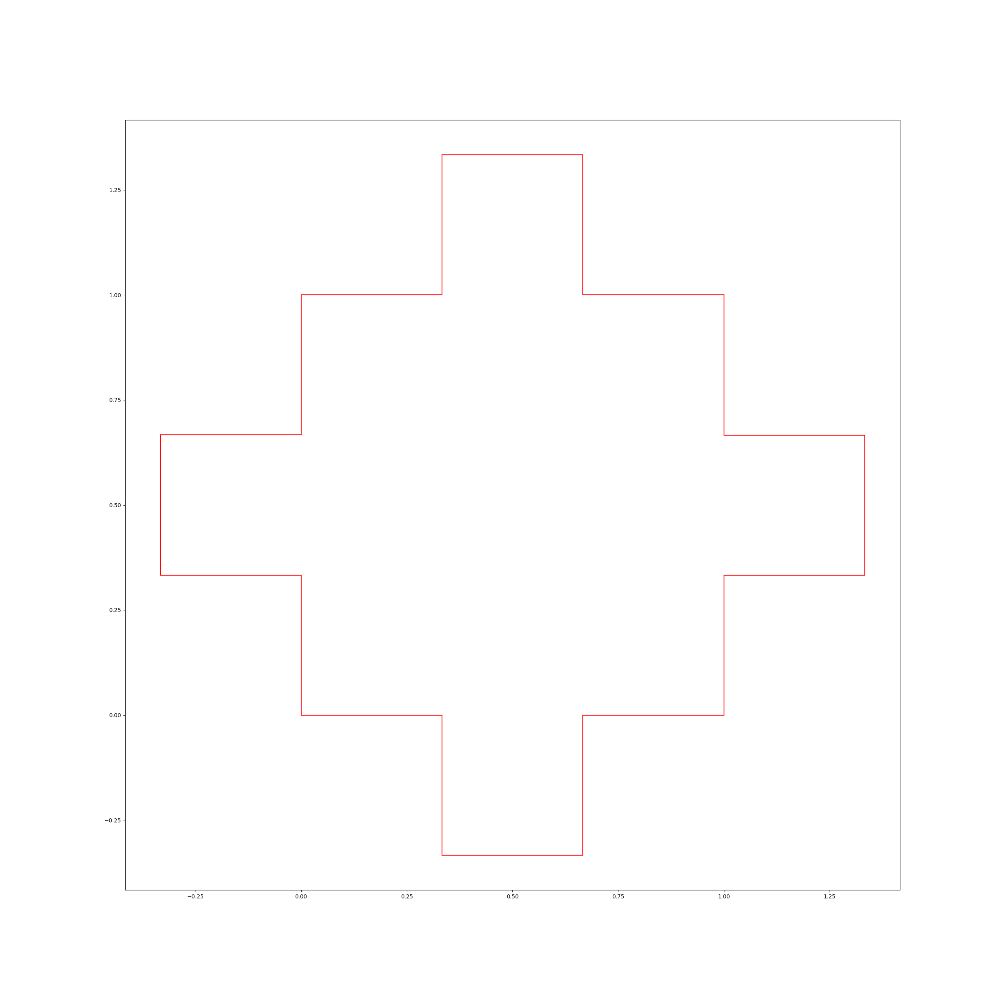

# DYNSYS-E2: Dynamic Systems | Square Fractal

## Affiliation

A project by Alexis Hassiel Nuviedo Arriaga ([@nuviedo](https://github.com/nuviedo)) ([alexis.nuviedo@gmail.com](mailto:alexis.nuviedo@gmail.com)), as part of the second partial exam of the Dynamic Systems 2022-2 class imparted at the [*Escuela Nacional de Estudios Superiores*, campus Morelia](https://www.enesmorelia.unam.mx/), [UNAM](https://www.unam.mx/), by Dr. [Victor de la Luz](https://github.com/itztli).

## Introduction

The problem resides in replicating the fractal roughly sketched in the following image:

## Methodology

The end result was produced through the use of hand-crafted geometry aid classes such that the fractal can be made in a simple yet effective manner, extending well to other boundaries. Numpy and Pandas were used as detailed in the requirements down below.

## Requirements
* [Numpy](https://numpy.org/)
* [Matplotlib](https://matplotlib.org/)

## Steps to reproduce

* Execute [Sol.py](Sol.py).
* Extract resulting .png from current working directory. 
* \[Optionally\] Create gif using convert from ImageMagick, outside the scope of this readme.

## Results

## References
De la Luz, V. (2022). Class: Dynamic Systems 2022-2. [ENES Unidad Morelia](https://www.enesmorelia.unam.mx/).

